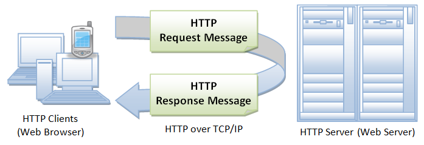
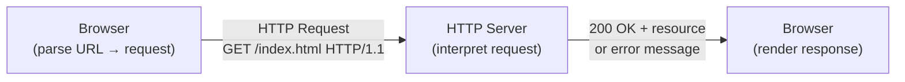

# Basics of HTTP

## Reference
Thanks these awesome folks for reference material!!
- [yet another insignificant programming notes: HTTP Basics](https://www3.ntu.edu.sg/home/ehchua/programming/webprogramming/HTTP_Basics.html)
- [yet another insignificant programming notes: State & Session Management](https://www3.ntu.edu.sg/home/ehchua/programming/webprogramming/HTTP_StateManagement.html)
- [yet another insignificant programming notes: HTTP Authentication](https://www3.ntu.edu.sg/home/ehchua/programming/webprogramming/HTTP_Authentication.html)
- [yet another insignificant programming notes: HTTP Security](https://www3.ntu.edu.sg/home/ehchua/programming/webprogramming/HTTP_SSL.html)

## Introduction
Internet is a massive information exchange system e.g. web-browsing/surfing, email, file transfer, video streaming etc. Applications on internet run on protocols e.g. HTTP, FTP, SMTP, etc. Among all the protocols, HTTP is the most widely used protocol for web-browsing/surfing on the Internet.

HTTP is an asymmetric request-response client-server protocol.



In layman's terms, A client sends a request to a server, and the server responds with a response. In other words, HTTP is a **pull** protocol, client pulls data from the server instead of the server pushing it to the client.

HTTP is **stateless**, which means the server does not need to know what has been transmitted previously. Instead it permits negotiation of data types and representations, which means:

- client can advertise what formats it accepts (e.g. `application/json`) and server can pick accordingly.
- No agreement is needed between client and server ahead of time - HTTP sort it out during runtime.
- allows system to be built independently of the data being transmitted.

To put it simply, ***HTTP = standardized wrapper, agnostic content***, similar to Layer 2 Ethernet frame header and payload relationship.

> *Quoting from the RFC2616: "The Hypertext Transfer Protocol (HTTP) is an application-level protocol for distributed, collaborative, hypermedia information systems. It is a generic, stateless, protocol which can be used for many tasks beyond its use for hypertext, such as name servers and distributed object management systems, through extension of its request methods, error codes and headers."*

### Browser

Whenever you issue a URL from your browser to get a web resource using HTTP, e.g. `http://www.nowhere123.com/index.html`, the browser turns the URL into a request message and sends it to the HTTP server. The HTTP server interprets the request message, and returns you an appropriate response message, which is either the resource you requested or an error message.



### Uniform Resource Locator (URL)
A URL (or commonly known as link) is used to uniquely identify a resource on the web, it usually consist of these components:

`protocol://hostname:port/path/filename`

You can treat it like a mail address:
- **Protocol**: How to talk
  - Application-level protocol used by the client and the server (e.g. `http`, `ftp`)
- **Hostname**: Who to talk to
  - The DNS domain name (e.g. `google.com`) or IP address of the server (e.g. `192.168.1.1`)
- **Port**: Which door to knock on
  - The TCP port the server is listening on
- **Path and filename**: What to ask for
  - The path and filename of the resource you want to retrieve (e.g. `/index.html`)

For example:

URL: `https://www.example.com:8080/about.html`
- **Communication protocol**: `https` (HTTP over TLS)
- **hostname**: `www.example.com`
- **port**: `443` since `https` uses port `443` by default when not specified
- **path and filename**: `/about.html`

The key concept is it is unique to the resource you want to retrieve, URL is designed to point to exactly one resource on the entire internet. When a certain component is left unspecified, the browser will use the default value (e.g. `https` for protocol, `443` for port, `/` for the index document).

One thing to note is that URL simply points to a resource, it does not guarantee that the resource still exists or is accessible. It can break when the resource is moved, deleted, or the server is down. That's why the U in URL stands for Uniform (consistent format) rather than Universal (guaranteed to work).

### Translating a URL to a GET request
When a URL is entered into a browser, the browser will translate the URL into a GET request and sends it to the server.

For example:
```GET
GET /docs/index.html HTTP/1.1
Host: www.nowhere123.com
Accept: image/gif, image/jpeg, */*
Accept-Language: en-us
Accept-Encoding: gzip, deflate
User-Agent: Mozilla/4.0 (compatible; MSIE 6.0; Windows NT 5.1)
```

To break down the above request:
1. `GET /docs/index.html HTTP/1.1`
  - GET method request to retrieve the resource at `/docs/index.html`
  - over HTTP/1.1
2. `Host: www.nowhere123.com`
  - from the server with address: `www.nowhere123.com`
3. `Accept: image/gif, image/jpeg, */*`  
  - the client advertises the data types it knows how to handle
  - e.g. `image/gif`: GIF image files, `image/jpeg`: JPEG image files, `*/*`: any other data type
4. `Accept-Encoding: gzip, deflate`
  - data like HTML, JSON and plain text compress well due to repeated patterns
  - the client accepts gzip and deflate encoding for the response
5. `User-Agent: Mozilla/4.0 (compatible; MSIE 6.0; Windows NT 5.1)`
  - identifies the client as a browser with the specified user agent string
  - server will use this to identify the client and respond accordingly
  - e.g. compatibility/mobile detection/bot detection/analytics

When the request message reaches the server, the server will parse the request and respond with either one of the following actions:

1. Interpret the request received and map the request to a resource on the server, then returns the resource to the client
2. Interpret the request received, run the appropriate server-side logic, and return the output to the client
3. If the request cannot be handled, return an error response to the client

### HTTP Response
An example of the HTTP response message is as shown:

```http
HTTP/1.1 200 OK
Date: Sun, 18 Oct 2009 08:56:53 GMT
Server: Apache/2.2.14 (Win32)
Last-Modified: Sat, 20 Nov 2004 07:16:26 GMT
ETag: "10000000565a5-2c-3e94b66c2e680"
Accept-Ranges: bytes
Content-Length: 44
Connection: close
Content-Type: text/html
X-Pad: avoid browser bug
  
<html><body><h1>It works!</h1></body></html>
```

To break down the response header:
1. `HTTP/1.1 200 OK`
  - Protocol version and status code
  - `200 OK` indicates the request succeeded
2. `Server: Apache/2.2.14 (Win32)`
  - identifies the server software and version
  - equivalent to `User-Agent` on the client side
3. `ETag: "10000000565a5-2c-3e94b66c2e680"`
  - entity tag, a unique fingerprint for this version of the resource
  - also used for caching and conditional requests
4. `Accept-Ranges: bytes` & `Content-Length: 44`
  - `Accept-Ranges: bytes` indicates the server supports partial content requests
  - `Content-Length: 44` indicates the response body is 44 bytes long
  - useful for resuming partial downloads or video seeking
5. `Content-Type: text/html`
  - indicates the response body is HTML content
  - used by browsers to determine how to display the response

A blank line separates headers from the body as required by the HTTP protocol. After the blank line is what we refer to the response body, which is the actual payload being sent - 44 bytes, matches the `Content-Length` header.

*side note: the X in `X-Pad` indicates this is a non-standard header, the example shows a known Apache workaround for an old Netscape bug.*

The browser receives the response, interprets the message and display the content of the response body according to the media type of the response specified in the `Content-Type` header.

#### MIME Types
> MIME stands for **Multipurpose Internet Mail Extensions**, originally designed for email attachments, HTTP adopted it to label content types.

The format for MIME types is always:
```
type/subtype
```

Common types include the following:

- text/html — HTML document
- text/plain — plain text
- image/jpeg — JPEG image
- image/gif — GIF image
- application/json — JSON data
- application/pdf — PDF file
- video/mp4 — MP4 video
