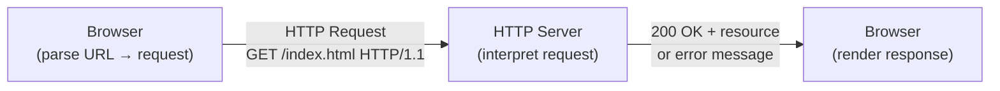

# HyperText Transfer Protocol (HTTP)

# Reference
Thanks these awesome folks for reference material!!
- [yet another insignificant programming notes: HTTP Basics](https://www3.ntu.edu.sg/home/ehchua/programming/webprogramming/HTTP_Basics.html)
- [yet another insignificant programming notes: State & Session Management](https://www3.ntu.edu.sg/home/ehchua/programming/webprogramming/HTTP_StateManagement.html)
- [yet another insignificant programming notes: HTTP Authentication](https://www3.ntu.edu.sg/home/ehchua/programming/webprogramming/HTTP_Authentication.html)
- [yet another insignificant programming notes: HTTP Security](https://www3.ntu.edu.sg/home/ehchua/programming/webprogramming/HTTP_SSL.html)

## Basics of HTTP
Internet is a massive information exchange system e.g. web-browsing/surfing, email, file transfer, video streaming etc. Applications on internet run on protocols e.g. HTTP, FTP, SMTP, etc. Among all the protocols, HTTP is the most widely used protocol for web-browsing/surfing on the Internet.

HTTP is an asymmetric request-response client-server protocol.

In layman's terms, A client sends a request to a server, and the server responds with a response. In other words, HTTP is a **pull** protocol, client pulls data from the server instead of the server pushing it to the client.

HTTP is **stateless**, which means the server does not need to know what has been transmitted previously. Instead it permits negotiation of data types and representations, which means:

- client can advertise what formats it accepts (e.g. `application/json`) and server can pick accordingly.
- No agreement is needed between client and server ahead of time - HTTP sort it out during runtime.
- allows system to be built independently of the data being transmitted.

To put it simply, ***HTTP = standardized wrapper, agnostic content***, similar to Layer 2 Ethernet frame header and payload relationship.

> *Quoting from the RFC2616: "The Hypertext Transfer Protocol (HTTP) is an application-level protocol for distributed, collaborative, hypermedia information systems. It is a generic, stateless, protocol which can be used for many tasks beyond its use for hypertext, such as name servers and distributed object management systems, through extension of its request methods, error codes and headers."*

### Case Study 1: Browser

Whenever you issue a URL from your browser to get a web resource using HTTP, e.g. `http://www.nowhere123.com/index.html`, the browser turns the URL into a request message and sends it to the HTTP server. The HTTP server interprets the request message, and returns you an appropriate response message, which is either the resource you requested or an error message.

