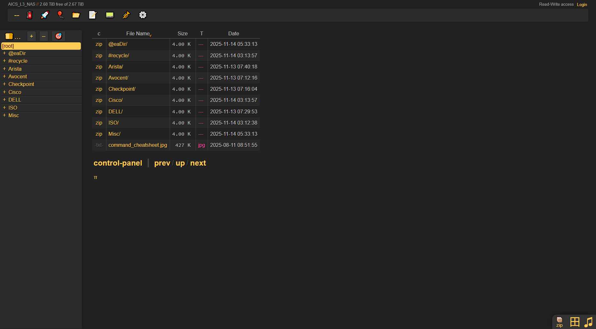

# Copyparty Setup Guide
> This guide will walk you through the process of setting up Copyparty on your system.

## Introduction


Copyparty is a versatile, portable file server for efficient file sharing and management across diverse operating systems. It's built with **Python** and features a **JavaScript** web interface.

Key features include:

-   **Accelerated Resumable Uploads**: Ensures reliable file transfers even under challenging network conditions.
-   **Data Deduplication**: Optimizes storage by preventing redundant file uploads.
-   **Multi-protocol Support**: Compatible with HTTP, WebDAV, FTP, and TFTP
-   **Media Features**: Supports direct viewing in browsers and generates thumbnails for quick reference before downloading media content.

---

## Installation
### Linux
For Linux systems, Copyparty can be easily installed using `pip` (Python's package installer). Ensure Python 3 and pip are installed on your system.

1.  **Install Copyparty (User-specific):**
    ```/dev/null/installation.sh#L1-1
    python3 -m pip install --user -U copyparty
    ```

2.  **Install Copyparty (via pipx - Recommended for System-wide):**
    On some Linux distributions, direct `pip` installation of system-wide packages might be restricted. `pipx` offers an isolated installation as a reliable alternative.
    ```/dev/null/installation.sh#L1-2
    # On debian-based system:
    sudo apt install pipx
    pipx install copyparty
    ```

### Windows
For Windows client devices or servers, Copyparty can be installed via `pip` or by directly running an executable.

1.  **Install Copyparty (User-specific via pip):**
    Ensure Python 3 is installed and accessible in your system's PATH.
    ```/dev/null/installation.bat#L1-1
    python -m pip install --user -U copyparty
    ```

2.  **Windows Executable (Alternative):**
    In environments where Python installation is restricted, an executable version of Copyparty is available. This option is self-contained but may not always be the most up-to-date or recommended due to security and performance considerations.
    Download `copyparty.exe` (for Windows 8 and newer) or `copyparty32.exe` (for Windows 7 and newer) from the official mirrors (e.g., `https://copyparty.eu/copyparty.exe`).
    Simply double-click the downloaded `.exe` file to start Copyparty.

### Standalone Script
Copyparty can also be run directly from its self-contained Python script (`copyparty-sfx.py`), requiring only a Python 3 interpreter.

1.  **Download the script:**
    ```/dev/null/installation.sh#L1-1
    curl -LO https://copyparty.eu/copyparty-sfx.py
    ```
    Alternatively, you can download it directly from the GitHub repository.
2.  **Execute the script:**
    ```/dev/null/installation.sh#L1-1
    python3 copyparty-sfx.py
    ```
    This will start Copyparty with default settings, typically serving files from the current directory.

### Docker
For containerized deployments, Copyparty can be run using Docker, providing an isolated and consistent environment.

1.  **Pull the Docker image:**
    ```/dev/null/installation.sh#L1-1
    docker pull 9001/copyparty:latest
    ```
2.  **Run Copyparty (example):**
    ```/dev/null/installation.sh#L1-1
    docker run --rm -it -p 3923:3923 -v /path/to/your/files:/srv 9001/copyparty
    ```
    This command starts a Copyparty container, mapping port 3923 and mounting a local directory for file serving.

---

## Usage
### One-off Terminal Execution
For quick, temporary file serving, Copyparty can be run directly from the terminal.

1.  **Navigate to the desired directory (optional):**
    Open your terminal and `cd` into the directory you want to serve, or specify the path directly in the command.

2.  **Execute Copyparty (Linux):**
    If Copyparty was installed via `pip` or `pipx`, you can typically run:
    ```/dev/null/usage.sh#L1-1
    copyparty --chdir /path/to/your/volume
    ```
    Alternatively, or if `copyparty` is not in your PATH:
    ```/dev/null/usage.sh#L1-1
    python3 -m copyparty --chdir /path/to/your/volume
    ```
    Replace `/path/to/your/volume` with the actual path to the directory you wish to serve.

3.  **Execute Copyparty (Windows):**
    ```/dev/null/usage.bat#L1-1
    python -m copyparty --chdir C:\path\to\your\volume
    ```
    Replace `C:\path\to\your\volume` with the actual path.

### Systemd Service (Linux Servers)
For persistent operation on Linux servers, Copyparty can be configured as a `systemd` service to automatically start at boot and be managed via `systemctl`.

1.  **Create a systemd service file:**
    Create a file named `/etc/systemd/system/copyparty.service` with the following content (adjust `User`, `Group`, and `ExecStart` as needed):
    ```/etc/systemd/system/copyparty.service#L1-11
    [Unit]
    Description=Copyparty File Server
    After=network.target

    [Service]
    User=your_user
    Group=your_group
    ExecStart=/usr/bin/python3 -m copyparty --chdir /path/to/your/volume
    Restart=on-failure

    [Install]
    WantedBy=multi-user.target
    ```
    *   Replace `your_user` and `your_group` with appropriate system user and group.
    *   Update `/path/to/your/volume` to the directory Copyparty should serve.
    *   Using `python3 -m copyparty` in `ExecStart` is generally more robust for systemd services to ensure the correct Python environment is used.

2.  **Reload systemd and enable the service:**
    ```/dev/null/usage.sh#L1-2
    sudo systemctl daemon-reload
    sudo systemctl enable copyparty.service
    ```

3.  **Manage the service:**
    Once the service file is created and reloaded, you can manage Copyparty using `systemctl`.

    You can then use the following `systemctl` commands to manage Copyparty:

    *   **Start, stop, or restart the service:**
        ```/dev/null/usage.sh#L1-1
        sudo systemctl start copyparty.service
        sudo systemctl stop copyparty.service
        sudo systemctl restart copyparty.service
        ```

    *   **Check the service's status:**
        ```/dev/null/usage.sh#L1-1
        sudo systemctl status copyparty.service
        ```

    *   **Disable the service (prevent auto-start on boot):**
        ```/dev/null/usage.sh#L1-1
        sudo systemctl disable copyparty.service
        ```

You can then verify that Copyparty is running by accessing its web interface in a browser, typically at `http://your_server_ip:3923`.

### Synology NAS User-Defined Script
For Synology NAS devices, you can set up a user-defined script to launch Copyparty. This typically involves using the Task Scheduler in DSM.

1.  **Create a script file:**
    Create a shell script, for example, `/volume1/scripts/start_copyparty.sh`, with the following content:
    ```/volume1/scripts/start_copyparty.sh#L1-4
    #!/bin/bash
    /usr/bin/python3 -m copyparty --chdir /volume1/data/copyparty &
    echo "Copyparty started."
    ```
    *   Ensure `/usr/bin/python3` is the correct path to Python on your Synology.
    *   Update `/volume1/data/copyparty` to the desired volume.
    *   The `&` at the end runs Copyparty in the background.

2.  **Make the script executable:**
    ```/dev/null/usage.sh#L1-1
    chmod +x /volume1/scripts/start_copyparty.sh
    ```

3.  **Configure Task Scheduler:**
    In Synology DSM, go to `Control Panel` > `Task Scheduler`. Create a new `Triggered Task` or `Scheduled Task` that executes this script at boot-up or a desired time.

You can then verify that Copyparty is running by accessing its web interface in a browser, typically at `http://your_server_ip:3923`.

---

## Configuration
Copyparty provides a range of command-line flags for quick setup and more advanced options via configuration files.

### Simple Setup Flags
For common scenarios, you can use the following flags directly when launching Copyparty:

*   **Serve a specific directory:**
    ```/dev/null/configuration.sh#L1-1
    copyparty --chdir /path/to/your/volume
    ```
    This serves the specified directory. By default, it runs on `http://0.0.0.0:3923/` and allows read-only access to anyone.

*   **Enable read/write access for a specific user:**
    ```/dev/null/configuration.sh#L1-1
    copyparty --chdir /path/to/your/volume -a username:password -v .::A,username
    ```
    This command sets up a user (`username` with `password`) and grants them full admin access (`A`) to the served directory.

*   **Change the listening port:**
    ```/dev/null/configuration.sh#L1-1
    copyparty -p 8080 --chdir /path/to/your/volume
    ```
    This example changes the default listening port from `3923` to `8080`.

### Advanced Configuration and Options
For more intricate setups, including detailed permission management, multiple volumes, advanced features, and using configuration files, refer to the official Copyparty GitHub repository:
[https://github.com/9001/copyparty/](https://github.com/9001/copyparty/)

There, you will find comprehensive documentation on all available flags (accessible via `copyparty --help` and `copyparty --help-flags`), as well as examples and guidelines for creating and managing configuration files.

---

## Troubleshooting
This section provides solutions to common issues that may arise during the setup and initial use of Copyparty.

### Firewall Blocking Connections
*   **Symptom:** Copyparty is running, but you are unable to access the web interface from another computer on the network. The connection times out.
*   **Cause:** A firewall on the server hosting Copyparty is blocking incoming connections on the required port.
*   **Solution:**
    *   You need to configure your server's firewall to allow incoming TCP traffic on the port Copyparty is using. For example, on a Linux server using `ufw`:
        ```/dev/null/troubleshooting.sh#L1-1
        sudo ufw allow 3923/tcp
        ```
    *   On Windows, you will need to create an inbound rule in the "Windows Defender Firewall with Advanced Security" to allow TCP traffic for the specified port.

### Filesystem Permissions: "Permission denied"
*   **Symptom:** Copyparty starts successfully, but you see "Permission denied" errors in the web UI when trying to list directories or access files.
*   **Cause:** The user account running the Copyparty process lacks the necessary read permissions for the files and directories it is configured to serve.
*   **Solution:**
    1.  Ensure that the user running Copyparty has at least read (`r`) and execute (`x`) permissions for the directories being served, and read (`r`) permission for the files.
    2.  You can use the `chmod` and `chown` commands on Linux to recursively apply the correct permissions. For example:
        ```/dev/null/troubleshooting.sh#L1-1
        sudo chmod -R 755 /path/to/your/volume
        ```

### Command Not Found
*   **Symptom:** After installing via `pip` or `pipx`, typing `copyparty` in your terminal results in an error like `copyparty: command not found`.
*   **Cause:** The directory where `pip` or `pipx` installs executables is not included in your system's `PATH` environment variable.
*   **Solution:**
    1.  Ensure the user's local bin directory is in your PATH. For Linux, this is typically `~/.local/bin`. You may need to restart your terminal session or log out and back in for changes to take effect.
    2.  As a reliable alternative, you can always run Copyparty directly as a Python module, which does not depend on the `PATH`:
        ```/dev/null/troubleshooting.sh#L1-1
        python3 -m copyparty
        ```

### Cisco Encryption Issue

If you encounter SSH/SFTP connection problems from Cisco devices or other legacy clients, it’s likely due to outdated encryption algorithms. Modern Linux systems disable these algorithms by default for security reasons. To restore compatibility, follow these steps:

#### 1. Ensure the RSA Host Key Exists

Check if the RSA host key is present:
```shell
ls /etc/ssh/ssh_host_*
```
Look for `/etc/ssh/ssh_host_rsa_key`.  
If it’s missing, generate it:
```shell
sudo ssh-keygen -t rsa -f /etc/ssh/ssh_host_rsa_key
```
Add this key to your SSH configuration file (`/etc/ssh/sshd_config`):
```shell
HostKey /etc/ssh/ssh_host_rsa_key
```

#### 2. Enable Legacy Algorithms and Ciphers

In `/etc/ssh/sshd_config`, add or update the following lines to allow older algorithms:
```shell
PubkeyAcceptedAlgorithms +ssh-rsa
HostKeyAlgorithms +ssh-rsa
Ciphers +aes128-cbc,aes256-cbc,3des-cbc
KexAlgorithms +diffie-hellman-group14-sha1
```

#### 3. Restart the SSH Service

Apply the changes by restarting SSH:
```shell
sudo systemctl restart ssh
```

---

**Note:**  
Enabling these legacy algorithms reduces your server’s security. Only use these settings if absolutely necessary, and consider reverting them when legacy access is no longer required.

---

## Credits and Licensing
Copyparty is an open-source project released under the **MIT License**. **Important:** The usage of this software must strictly comply with the terms of the MIT License as explicitly stated in the official Copyparty GitHub repository. For comprehensive information on contributing or to review the full license text, please visit:

*   **Official GitHub Repository:** [https://github.com/9001/copyparty/](https://github.com/9001/copyparty/)
*   **MIT License Text:** [https://github.com/9001/copyparty/blob/master/LICENSE](https://github.com/9001/copyparty/blob/master/LICENSE)
